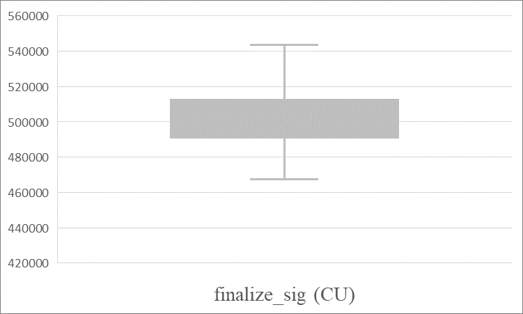
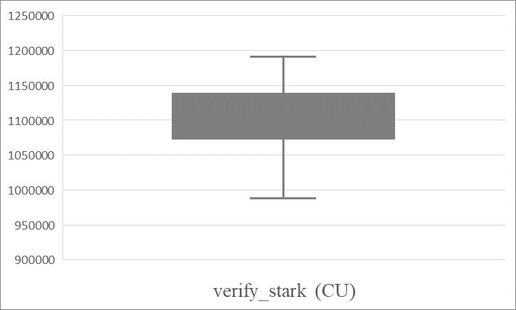

# Solana PQZK Full‑Chain (PoC) 🧪

[](LICENSE)
[](LICENSE)
[](https://github.com/pqzk-labs/solana-pqzk-fullchain/actions/workflows/ci.yml)
[](https://doi.org/10.5281/zenodo.17186799)

> ⚠️ Status: Research-only / Not audited.

🔬📄 **Paper:** [IACR ePrint 2025/1741](https://eprint.iacr.org/2025/1741) • [DOI:10.5281/zenodo.17186799](https://doi.org/10.5281/zenodo.17186799)

Fully on‑chain verifier demo on Solana L1 (CPI‑friendly):
ZK-STARK (Winterfell 0.12) + SLH‑DSA (SPHINCS+, NIST FIPS 205) signature + ML‑KEM/Kyber (NIST FIPS 203) KEM.

## ⚙️ What it does
- On‑chain verification:  
  - STARK (Winterfell 0.12) for a minimal affine‑counter AIR  
  - SLH‑DSA (SPHINCS+, NIST FIPS 205) signature verification (SHA2‑128s)
- Full message persisted on chain as a single account: cipher + ML‑KEM/Kyber (NIST FIPS 203) ciphertext + STARK proof + metadata
- Chunked uploads with hash chaining to control DoS and fees
- Custom heap allocator and CU tuning for SBF (Solana BPF)

Devnet program id (Anchor): `CECNRbDxFQVfWiQwvG8qcSGPGSk8eLWraBCERcdL5DKT`

## 🌍 Why this matters
Pairing‑based SNARKs rely on hardness assumptions (e.g., discrete logs) that are theoretically vulnerable to Shor’s algorithm on a sufficiently capable quantum computer.  
This PoC demonstrates a fully on‑chain alternative using a hash‑based STARK, SLH‑DSA (SPHINCS+, NIST FIPS 205), and ML‑KEM/Kyber (NIST FIPS 203).

## 📂 Layout
- programs/stark-pqc-verifier — L1 verifier program (CPI-friendly)  
- examples/cli-chat — end-to-end demo: encrypt, prove, sign, upload, finalize, receive  
- examples/benchmarks — scripts & logs to measure compute unit (CU) usage  
- img/ — benchmark figures used in the paper  
- crates/stark-prover — local STARK prover (Winterfell 0.12)  
- crates/slh-dsa-wasm — SLH-DSA (SPHINCS+, NIST FIPS 205) bindings for Node/TS via wasm-pack  
- crates/kem-cli — ML-KEM/Kyber768 helper used by the demo  
- .github/workflows/ci.yml — CI workflow: builds the program (`anchor build`) and client-side artifacts on each push/PR;  
  skips steps that depend on devnet (deployments/transactions/benchmarks)
- fixed/ — pinned IDL/types for running without local Anchor build  
- third-party/* — vendored dependencies (patched for Solana BPF)  
- Other infra files: Anchor.toml, .cargo/config.toml, etc.

## 🧩 Usage examples

| Example | What it demonstrates | Typical workflow | Details |
|---|---|---|---|
| On-chain verifier | Buffer initialization, chunked uploads, SLH-DSA verification, and STARK verification. | `init_buffer` / `init_signature` → `upload_body` / `upload_signature` → `finalize_sig` → `verify_stark` | [`programs/stark-pqc-verifier`](programs/stark-pqc-verifier/) |
| CLI chat | Complete encrypt, prove, sign, upload, verify, and decrypt workflow. | `setup` → `keys` → `upload` → `finalize` → `receive` | [`examples/cli-chat`](examples/cli-chat/) |
| Benchmarks | Repeated execution and CU measurement of verification steps. | Enable instrumented `finalize.ts` → run benchmark script → inspect `results.csv` | [`examples/benchmarks`](examples/benchmarks/) |

The linked README files provide detailed commands, limits, and configuration notes.

## 🚀 Quick start
Default: run without Anchor build/deploy using the pinned IDL/types under fixed/.  
Prereqs (tested with): Rust 1.88.0, Cargo 1.88.0, Solana CLI 2.2.20 (Agave), Node.js v24.4.0, npm 11.4.2, wasm‑pack 0.13.1
> **Note:** Tested on Linux, macOS, and Windows Subsystem for Linux (WSL2).  
> Native Windows without WSL is not supported by solana-cli and may not work.
 
### Steps

0. **Install dependencies**

    * Install Rust and Cargo: <https://doc.rust-lang.org/cargo/getting-started/installation.html>
    * Install wasm-pack: <https://crates.io/crates/wasm-pack>
    * Install Solana CLI: <https://solana.com/docs/intro/installation>
    * Install Node.js <https://nodejs.org/en/download>
    
    Before running the demo, install the Node.js packages for the CLI example:  
    
    ```
    npm --prefix examples/cli-chat install 
    ```


1. **Connect to devnet & fund your wallet**

    If you don't have wallet:
    ```
    solana config set --url devnet
    solana-keygen new
    solana airdrop 2
    ```

    If you already have a wallet: 
    ```
    solana config set --url devnet
    solana airdrop 2
    ```

    By default, both Anchor and the TypeScript CLI use the same Solana keypair at:
    - `~/.config/solana/id.json`

    You only need to do something here if you want to use a different keypair:
    For the CLI demo, set one of (example):
     - `ANCHOR_WALLET=/path/to/keypair.json`
     - `SOLANA_KEYPAIR=/path/to/keypair.json`

    For Anchor, edit `Anchor.toml`:
     - `[provider].wallet = "/path/to/keypair.json"`

2. **Run the pinned devnet demo (no build/deploy needed)**

    ```
    npm --prefix examples/cli-chat run setup 
    npm --prefix examples/cli-chat run keys 
    npm --prefix examples/cli-chat run upload 
    npm --prefix examples/cli-chat run finalize 
    npm --prefix examples/cli-chat run receive 
    ```

    **Expected output (success):**  
    `finalize` prints two successful steps (`step-1 done` and `step-2 done`) and shows consumed CU for each transaction.  
    `receive` ends with:
      - `PLAINTEXT = Hello world!`
      - `receive ✅`
    
    Notes:
    - The SDK reads `fixed/idl/stark_pqc_verifier.json` and `fixed/types/stark_pqc_verifier.ts` by default.
    - The devnet program id is taken from the IDL’s metadata.address.
    - The commands above still build client-side crates during npm run setup.

### Use your own deployment (Optional)

**Goal:** run the CLI demo against *your* deployed program instead of the pinned devnet deployment in `fixed/`.

```
anchor build
anchor deploy
```

Set your deployed ID in program code:  
programs/stark-pqc-verifier/src/lib.rs → `declare_id!("YOUR_PROGRAM_ID");`  

Set it in Anchor config:  
Anchor.toml → `[programs.devnet].stark_pqc_verifier = "YOUR_PROGRAM_ID"`

Then edit `examples/cli-chat/src/utils/sdk.ts` to point to `target/` instead of `fixed/`:

    import type { StarkPqcVerifier } from '../../../../target/types/stark_pqc_verifier.ts';  
    const idlPath = resolve(__dirname, '../../../../target/idl/stark_pqc_verifier.json');  

Ensure `target/idl/stark_pqc_verifier.json` contains your deployed program id in metadata.address.

## 📝 Design notes
Public inputs for the AIR are derived on chain from SHA256(cipher) to bind the proof to the ciphertext.
SLH‑DSA verification signs cipher || kem || nonce || slot_le.  
Buffers are uploaded in ≤ 900‑byte chunks with running SHA‑256 to ensure integrity.  
A small custom allocator avoids writable ELF sections; clients provide a heap frame matching the on‑chain limit.

### Advanced (optional): Hashers & FRI
- Hasher
  - Default: Sha2_256 (uses Solana hashv; good CU).
  - Tested: Blake3_256 (software on BPF). Reliable at ~64‑bit security; ~128‑bit typically exceeds CU and fails.
  - Proofs are hasher‑specific (not interchangeable).

- Security / FRI
  - Prover: tune ProofOptions (queries / blowup / grinding).
  - Verifier: set AcceptableOptions::MinConjecturedSecurity(N) to match the target (N ≤ 127; 127 is the cap).
  - For Blake3 experiments, start with N = 64.

If you change hasher or security, regenerate the proof and re‑upload.

## 📊 Benchmark results
The following figures show the benchmark results presented in the paper.

<table>
  <tr>
    <td align="center"> </td>
    <td align="center"> </td>
  </tr>
  <tr>
    <td align="center">finalize_sig</td> <td align="center">verify_stark</td>
  </tr>
</table>

For the benchmark procedure and numerical results, see [examples/benchmarks](examples/benchmarks/).

## 🛡️ Safety and status
We implement algorithm families standardized as NIST FIPS 203 (ML‑KEM) and FIPS 205 (SLH‑DSA/SPHINCS+) via open‑source crates.  
This repository is not FIPS‑validated and is provided for research and testing only.  
Use at your own risk; parameters and implementation are subject to change.

## ⚖️ License
This project is dual-licensed under either:

- MIT License (see LICENSE-MIT)
- Apache License, Version 2.0 (see LICENSE-APACHE)

at your option.  

Vendored code in third-party/*: upstream licenses apply and take precedence.

## 🔐 Encryption Notice
This repository contains cryptographic software (ML‑KEM/Kyber, SLH‑DSA, AES‑256‑GCM, SHA‑256).  
Export/import and use of strong encryption may be regulated in your jurisdiction.  
You are responsible for compliance with all applicable laws.  
This code is provided for research and testing without warranty, and is not intended for unlawful use or to circumvent regulations.
